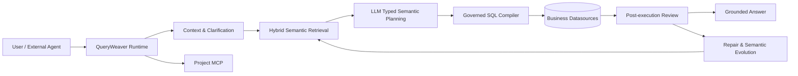

<div align="center">

# QueryWeaver

**面向生产环境的自进化 NL2SQL 平台**

自然语言 → 语义理解 → Typed Semantic Plan → 受治理 SQL → 可恢复执行 → 持续学习


</div>

QueryWeaver 不是“把问题直接丢给大模型生成 SQL”的薄封装。它以**受治理语义模型**为事实基础，让大模型负责语义规划，让编译器负责 SQL 落地，并在运行时提供澄清、审批、Review/Repair、持久化恢复和语义进化能力。

它既可以作为完整的问数产品使用，也可以把某个项目的问数能力一键发布为 **Project MCP Server**，供外部 Agent 复用同一套语义、权限和执行治理。

## 核心能力

| 能力 | 说明 |
| --- | --- |
| **Semantic-first NL2SQL** | LLM 生成结构化 `SemanticQueryPlan`，SQL 由受治理编译链生成，而不是直接信任模型 SQL |
| **Hybrid Semantic Retrieval** | Exact + BM25 + pgvector 混合召回，并通过 RRF 融合多个召回通道 |
| **Clarification & Approval** | 运行时歧义必须澄清；审批独立支持 `REQUIRE_APPROVAL` / `AUTO_EXECUTE` |
| **Review & Repair** | 执行后按 `PASS / RETRY_SQL / REPLAN / RERETRIEVE / CLARIFY / FAIL` 路由闭环修复 |
| **Durable Runtime** | QueryRun、RunEvent、Checkpoint、Lease、Idempotency 支持断线、重启和失败恢复 |
| **Semantic Evolution** | Validated Query Case、Semantic Correction、Replay 将高质量运行结果沉淀回项目语义资产 |
| **Multi-source Execution** | Query / Source / Execution 三层拆解，在统一 QueryTask DAG 中受控执行多数据源查询 |
| **Project MCP** | 将项目级问数能力发布为标准 MCP 数据面，外部 Agent 无需复制 QueryWeaver 内部逻辑 |

## 架构



核心执行链路：

```text
QueryTask
  → SemanticQueryPlan
  → SourceSubPlan
  → SemanticSqlCompiler
  → SQL Execution
  → Post-execution Review
  → Grounded Synthesis
```

## 快速开始

### 1. 环境要求

完整本地部署只要求：

- Docker + Docker Compose
- 一个兼容 OpenAI API 的 Chat Model
- 一个兼容 OpenAI Embeddings API 的 Embedding Model

如果要直接从源码构建后端，还需要 **JDK 17**；开发前端需要 **Node.js 22.12+ + npm**。

### 2. 准备配置

```bash
cp config/model-env.example .env.local
cp deploy/queryweaver/.env.example deploy/queryweaver/.env
```

然后填写模型地址/API Key、数据库密码和安全相关配置。真实密钥文件已被 `.gitignore` 排除，不应提交到仓库。

Embedding 可以是本机服务，也可以是外部 OpenAI-compatible Embeddings API。`QUERYWEAVER_MANAGE_EMBEDDING_MODEL=auto` 时，仅对本地 `localhost` / `host.docker.internal` 地址尝试管理本地 embedding 容器；外部地址不会依赖任何本机预构建镜像。

### 3. 一键构建并启动

```bash
QUERYWEAVER_BUILD=true ./scripts/start-queryweaver.sh
```

启动完成后：

- Web Console: `http://127.0.0.1:23000/queryweaver`
- Backend: `http://127.0.0.1:28065`
- Health Check: `http://127.0.0.1:28065/actuator/health`

## 从源码运行

### Backend

```bash
./mvnw -pl backend -am -Dmaven.test.skip=true package
java -jar backend/target/queryweaver.jar
```

QueryWeaver 使用 Maven Wrapper，因此**不要求开发机预装 Maven**。只需让 JDK 17 正确出现在当前环境中，不绑定任何特定机器的 `JAVA_HOME` 路径。

后端 Maven 坐标：

```text
cn.lgs.queryweaver:queryweaver
```

可执行产物固定为：

```text
backend/target/queryweaver.jar
```

### Frontend

```bash
cd frontend
npm ci
npm run dev
```

生产构建：

```bash
npm run build
```

## Project MCP

QueryWeaver 可以把一个已发布项目直接暴露为 MCP 数据面。外部 Agent 通过统一工具访问项目语义能力，而不是自行生成和执行不受治理的 SQL。

默认提供五个工具：

```text
search_semantics
get_semantic_context
validate_query_plan
execute_query_plan
get_query_result
```

MCP 与 Web Chat 共享同一套项目版本、语义目录、权限、执行治理和 Durable Result。

## 配置约定

QueryWeaver 自身的 Spring 配置使用独立命名空间：

```text
cn.lgs.queryweaver.*
```

运行环境变量统一使用：

```text
QUERYWEAVER_*
```

主要配置入口：

| 文件 | 用途 |
| --- | --- |
| `.env.local` | Chat / Embedding 等模型服务 |
| `deploy/queryweaver/.env` | Compose、数据库、端口和部署安全配置 |
| `backend/src/main/resources/application.yml` | 后端默认运行配置 |

## 仓库结构

```text
QueryWeaver/
├── backend/                 # Spring Boot 后端与 QueryWeaver Runtime
├── frontend/                # Vue 3 Web Console
├── config/                  # 构建与模型配置模板
│   └── checkstyle/
├── deploy/                  # Dockerfile、Compose 与初始化资源
│   └── queryweaver/
├── scripts/                 # 启动、模型准备与部署辅助脚本
├── .mvn/                    # Maven Wrapper 运行时文件
├── mvnw
├── pom.xml
└── README.md
```

`.mvn/` 与 `mvnw` 是 Maven Wrapper 的组成部分，应该随仓库提交；它们保证不同开发机和 CI 环境可以使用一致的 Maven 启动方式。

## License

Apache License 2.0
